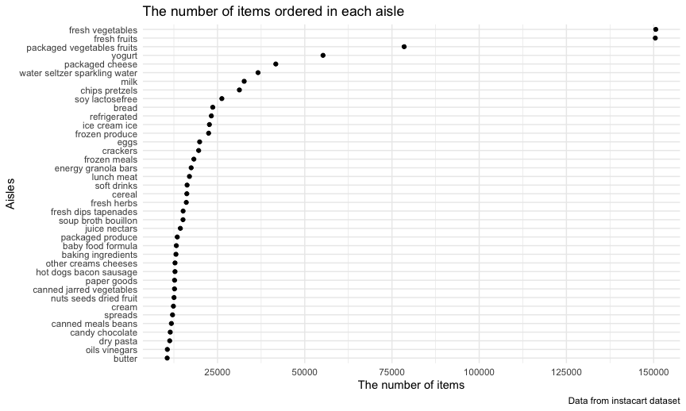

p8105\_hw3\_yj2686
================
Yiqun Jin
10/16/2021

## Problem 1

**Load instacart dataset**

``` r
data("instacart")
```

Description of instacart dataset:

The instacart dataset is an anonymized dataset with over 3 million
online grocery orders from more than 200,000 Instacart users. This
dataset contains 1384617 observations of products from online orders,
and 15 variables which are order\_id, product\_id, add\_to\_cart\_order,
reordered, user\_id, eval\_set, order\_number, order\_dow,
order\_hour\_of\_day, days\_since\_prior\_order, product\_name,
aisle\_id, department\_id, aisle, department.

How many aisles are there, and which aisles are the most items ordered
from?

There are `134` aisles and the most items ordered from
`fresh vegetables`

``` r
instacart %>% 
  group_by(aisle_id, aisle) %>%
  summarize(count = n()) %>%
  arrange(desc(count))
```

    ## `summarise()` has grouped output by 'aisle_id'. You can override using the `.groups` argument.

    ## # A tibble: 134 × 3
    ## # Groups:   aisle_id [134]
    ##    aisle_id aisle                          count
    ##       <int> <chr>                          <int>
    ##  1       83 fresh vegetables              150609
    ##  2       24 fresh fruits                  150473
    ##  3      123 packaged vegetables fruits     78493
    ##  4      120 yogurt                         55240
    ##  5       21 packaged cheese                41699
    ##  6      115 water seltzer sparkling water  36617
    ##  7       84 milk                           32644
    ##  8      107 chips pretzels                 31269
    ##  9       91 soy lactosefree                26240
    ## 10      112 bread                          23635
    ## # … with 124 more rows

Make a plot that shows the number of items ordered in each aisle,
limiting this to aisles with more than 10000 items ordered. Arrange
aisles sensibly, and organize your plot so others can read it.

``` r
instacart %>% 
  count(aisle) %>% 
  rename(ordered_num = n) %>% 
  filter(ordered_num > 10000) %>% 
  mutate(
    aisle = fct_reorder(aisle, ordered_num)
  ) %>% 
  ggplot(aes(x = ordered_num, y = aisle)) +
  geom_point() +
  scale_x_continuous(breaks = scales::pretty_breaks(ordered_num = 10)) +
  labs(
    title = "The number of items ordered in each aisle",
    x = "The number of items",
    y = "Aisles",
    caption = "Data from instacart dataset"
  ) 
```



Make a table showing the three most popular items in each of the aisles
“baking ingredients”, “dog food care”, and “packaged vegetables fruits”
and the number of times each item is ordered.

``` r
instacart %>% 
  filter(aisle == c("baking ingredients", "dog food care", "packaged vegetables fruits")) %>% 
  group_by(aisle) %>% 
  count(product_name) %>% 
  rename(ordered_times = n) %>% 
  mutate(rank = min_rank(desc(ordered_times))) %>% 
  filter(rank < 4) %>% 
  relocate(aisle, rank) %>% 
  arrange(aisle, rank) %>% 
  knitr::kable()
```

| aisle                      | rank | product\_name                                   | ordered\_times |
|:---------------------------|-----:|:------------------------------------------------|---------------:|
| baking ingredients         |    1 | Light Brown Sugar                               |            157 |
| baking ingredients         |    2 | Pure Baking Soda                                |            140 |
| baking ingredients         |    3 | Organic Vanilla Extract                         |            122 |
| dog food care              |    1 | Organix Grain Free Chicken & Vegetable Dog Food |             14 |
| dog food care              |    2 | Organix Chicken & Brown Rice Recipe             |             13 |
| dog food care              |    3 | Original Dry Dog                                |              9 |
| packaged vegetables fruits |    1 | Organic Baby Spinach                            |           3324 |
| packaged vegetables fruits |    2 | Organic Raspberries                             |           1920 |
| packaged vegetables fruits |    3 | Organic Blueberries                             |           1692 |

Make a table showing the mean hour of the day at which Pink Lady Apples
and Coffee Ice Cream are ordered on each day of the week:

``` r
instacart %>% 
  filter(product_name %in% c("Pink Lady Apples", "Coffee Ice Cream")) %>% 
  group_by(product_name, order_dow) %>% 
  summarize(mean_hour = mean(order_hour_of_day)) %>% 
  mutate(order_dow = ifelse(order_dow == 0, "Sunday", order_dow),
         order_dow = ifelse(order_dow == 1, "Monday", order_dow),
         order_dow = ifelse(order_dow == 2, "Tuesday", order_dow),
         order_dow = ifelse(order_dow == 3, "Wednesday", order_dow),
         order_dow = ifelse(order_dow == 4, "Thursday", order_dow),
         order_dow = ifelse(order_dow == 5, "Friday", order_dow),
         order_dow = ifelse(order_dow == 6, "Saturday", order_dow)) %>% 
  pivot_wider(
    names_from = order_dow,
    values_from = mean_hour
  ) %>% 
  knitr::kable()
```

    ## `summarise()` has grouped output by 'product_name'. You can override using the `.groups` argument.

| product\_name    |   Sunday |   Monday |  Tuesday | Wednesday | Thursday |   Friday | Saturday |
|:-----------------|---------:|---------:|---------:|----------:|---------:|---------:|---------:|
| Coffee Ice Cream | 13.77419 | 14.31579 | 15.38095 |  15.31818 | 15.21739 | 12.26316 | 13.83333 |
| Pink Lady Apples | 13.44118 | 11.36000 | 11.70213 |  14.25000 | 11.55172 | 12.78431 | 11.93750 |

## Problem 2

**Load BRFSS dataset**

``` r
data("brfss_smart2010")
```

**Data Cleaning**

``` r
brfss_df = brfss_smart2010 %>% 
  janitor::clean_names() %>% 
  separate(locationdesc, into = c("state", "location"), sep = '-') %>% 
  filter(topic == c("Overall Health")) %>% 
  mutate(response = factor(response, levels = c("Poor", "Fair", "Good", "Very good", "Excellent"),ordered = TRUE)) %>% 
  arrange(response) %>% 
  ##select(-locationabbr)
  select(-locationabbr, -class, -topic,  -question, -c(confidence_limit_low:geo_location))
```

    ## Warning: Expected 2 pieces. Additional pieces discarded in 500 rows [4211, 4212,
    ## 4213, 4214, 4215, 4216, 4217, 4218, 4219, 4220, 4221, 4222, 4223, 4224, 4225,
    ## 4226, 4227, 4228, 4229, 4230, ...].

``` r
brfss_df %>% view()
```

1.  In 2002, which states were observed at 7 or more locations? What
    about in 2010?

``` r
brfss_2002 = brfss_df %>% 
  filter(year == 2002) %>% 
  group_by(state) %>% 
  distinct(location) %>% 
  count(state) %>% 
  filter(n >= 7)

brfss_2002[1]
```

    ## # A tibble: 6 × 1
    ## # Groups:   state [6]
    ##   state
    ##   <chr>
    ## 1 "CT "
    ## 2 "FL "
    ## 3 "MA "
    ## 4 "NC "
    ## 5 "NJ "
    ## 6 "PA "

ANSWER: CT, FL, MA, NC, NJ, PA were observed at 7 or more locations in
2002.

``` r
brfss_2010 = brfss_df %>% 
  filter(year == 2010) %>% 
  group_by(state) %>% 
  distinct(location) %>% 
  count(state) %>% 
  filter(n >= 7)

brfss_2010[1]
```

    ## # A tibble: 14 × 1
    ## # Groups:   state [14]
    ##    state
    ##    <chr>
    ##  1 "CA "
    ##  2 "CO "
    ##  3 "FL "
    ##  4 "MA "
    ##  5 "MD "
    ##  6 "NC "
    ##  7 "NE "
    ##  8 "NJ "
    ##  9 "NY "
    ## 10 "OH "
    ## 11 "PA "
    ## 12 "SC "
    ## 13 "TX "
    ## 14 "WA "

ANSWER: CA, CO, FL, MA, MD, NC, NJ, NY, OH, PA, SC, TX, WA were observed
at 7 or more locations in 2002.
