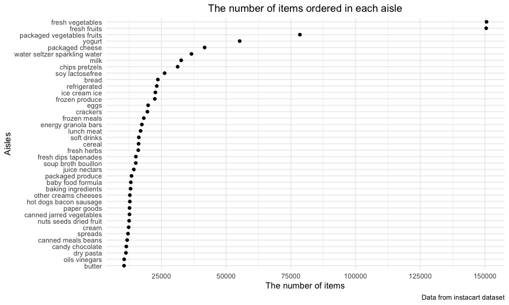
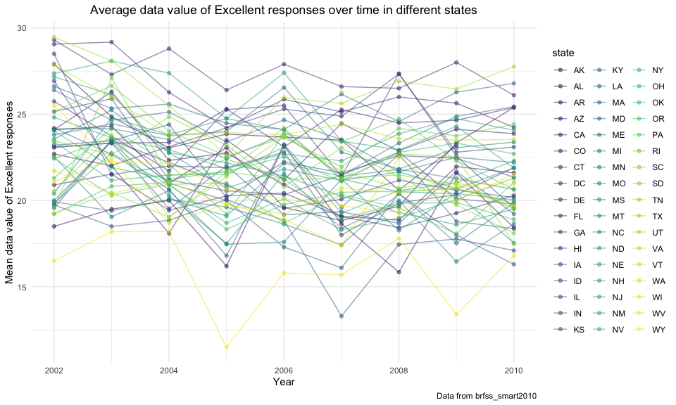
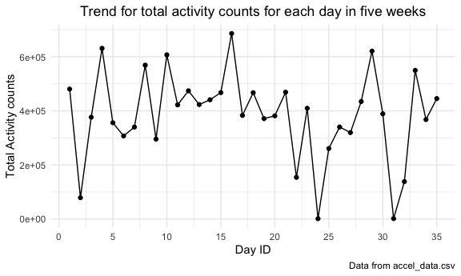
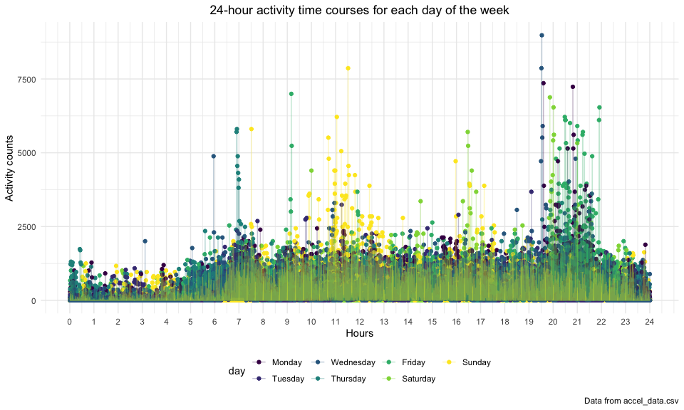

p8105\_hw3\_yj2686
================
Yiqun Jin
10/16/2021

## Problem 1

**Load instacart dataset**

``` r
data("instacart")
```

Description of instacart dataset:

The instacart dataset is an anonymized dataset with over 3 million
online grocery orders from more than 200,000 Instacart users. This
dataset contains 1384617 observations of products from online orders,
and 15 variables which are order\_id, product\_id, add\_to\_cart\_order,
reordered, user\_id, eval\_set, order\_number, order\_dow,
order\_hour\_of\_day, days\_since\_prior\_order, product\_name,
aisle\_id, department\_id, aisle, department.

How many aisles are there, and which aisles are the most items ordered
from?

There are `134` aisles and the most items ordered from
`fresh vegetables`

``` r
instacart %>% 
  group_by(aisle_id, aisle) %>%
  summarize(count = n()) %>%
  arrange(desc(count))
```

    ## `summarise()` has grouped output by 'aisle_id'. You can override using the `.groups` argument.

    ## # A tibble: 134 × 3
    ## # Groups:   aisle_id [134]
    ##    aisle_id aisle                          count
    ##       <int> <chr>                          <int>
    ##  1       83 fresh vegetables              150609
    ##  2       24 fresh fruits                  150473
    ##  3      123 packaged vegetables fruits     78493
    ##  4      120 yogurt                         55240
    ##  5       21 packaged cheese                41699
    ##  6      115 water seltzer sparkling water  36617
    ##  7       84 milk                           32644
    ##  8      107 chips pretzels                 31269
    ##  9       91 soy lactosefree                26240
    ## 10      112 bread                          23635
    ## # … with 124 more rows

Make a plot that shows the number of items ordered in each aisle,
limiting this to aisles with more than 10000 items ordered. Arrange
aisles sensibly, and organize your plot so others can read it.

``` r
instacart %>% 
  count(aisle) %>% 
  rename(ordered_num = n) %>% 
  filter(ordered_num > 10000) %>% 
  mutate(
    aisle = fct_reorder(aisle, ordered_num)
  ) %>% 
  ggplot(aes(x = ordered_num, y = aisle)) +
  geom_point() +
  #scale_x_continuous(breaks = scales::pretty_breaks(ordered_num = 10)) +
  scale_x_continuous(breaks = c(0, 25000, 50000,75000, 100000, 125000, 150000)) +
  labs(
    title = "The number of items ordered in each aisle",
    x = "The number of items",
    y = "Aisles",
    caption = "Data from instacart dataset"
  ) 
```



Make a table showing the three most popular items in each of the aisles
“baking ingredients”, “dog food care”, and “packaged vegetables fruits”
and the number of times each item is ordered.

``` r
instacart %>% 
  filter(aisle == c("baking ingredients", "dog food care", "packaged vegetables fruits")) %>% 
  group_by(aisle) %>% 
  count(product_name) %>% 
  rename(ordered_times = n) %>% 
  mutate(rank = min_rank(desc(ordered_times))) %>% 
  filter(rank < 4) %>% 
  relocate(aisle, rank) %>% 
  arrange(aisle, rank) %>% 
  knitr::kable()
```

| aisle                      | rank | product\_name                                   | ordered\_times |
|:---------------------------|-----:|:------------------------------------------------|---------------:|
| baking ingredients         |    1 | Light Brown Sugar                               |            157 |
| baking ingredients         |    2 | Pure Baking Soda                                |            140 |
| baking ingredients         |    3 | Organic Vanilla Extract                         |            122 |
| dog food care              |    1 | Organix Grain Free Chicken & Vegetable Dog Food |             14 |
| dog food care              |    2 | Organix Chicken & Brown Rice Recipe             |             13 |
| dog food care              |    3 | Original Dry Dog                                |              9 |
| packaged vegetables fruits |    1 | Organic Baby Spinach                            |           3324 |
| packaged vegetables fruits |    2 | Organic Raspberries                             |           1920 |
| packaged vegetables fruits |    3 | Organic Blueberries                             |           1692 |

Make a table showing the mean hour of the day at which Pink Lady Apples
and Coffee Ice Cream are ordered on each day of the week:

``` r
instacart %>% 
  filter(product_name %in% c("Pink Lady Apples", "Coffee Ice Cream")) %>% 
  group_by(product_name, order_dow) %>% 
  summarize(mean_hour = mean(order_hour_of_day)) %>% 
  mutate(order_dow = ifelse(order_dow == 0, "Sunday", order_dow),
         order_dow = ifelse(order_dow == 1, "Monday", order_dow),
         order_dow = ifelse(order_dow == 2, "Tuesday", order_dow),
         order_dow = ifelse(order_dow == 3, "Wednesday", order_dow),
         order_dow = ifelse(order_dow == 4, "Thursday", order_dow),
         order_dow = ifelse(order_dow == 5, "Friday", order_dow),
         order_dow = ifelse(order_dow == 6, "Saturday", order_dow)) %>% 
  pivot_wider(
    names_from = order_dow,
    values_from = mean_hour
  ) %>% 
  knitr::kable()
```

    ## `summarise()` has grouped output by 'product_name'. You can override using the `.groups` argument.

| product\_name    |   Sunday |   Monday |  Tuesday | Wednesday | Thursday |   Friday | Saturday |
|:-----------------|---------:|---------:|---------:|----------:|---------:|---------:|---------:|
| Coffee Ice Cream | 13.77419 | 14.31579 | 15.38095 |  15.31818 | 15.21739 | 12.26316 | 13.83333 |
| Pink Lady Apples | 13.44118 | 11.36000 | 11.70213 |  14.25000 | 11.55172 | 12.78431 | 11.93750 |

## Problem 2

**Load BRFSS dataset**

``` r
data("brfss_smart2010")
```

**Data Cleaning**

``` r
brfss_df = brfss_smart2010 %>% 
  janitor::clean_names() %>% 
  separate(locationdesc, into = c("state", "location"), sep = ' - ') %>% 
  filter(topic == c("Overall Health")) %>% 
  mutate(response = factor(response, levels = c("Poor", "Fair", "Good", "Very good", "Excellent"),ordered = TRUE)) %>% 
  arrange(response) %>% 
  select(-locationabbr)
  ##select(-locationabbr, -class, -topic,  -question, -c(confidence_limit_low:geo_location))
```

1.  In 2002, which states were observed at 7 or more locations? What
    about in 2010?

``` r
brfss_2002 = brfss_df %>% 
  filter(year == 2002) %>% 
  group_by(state) %>% 
  distinct(location) %>% 
  count(state) %>% 
  filter(n >= 7)

brfss_2002
```

    ## # A tibble: 6 × 2
    ## # Groups:   state [6]
    ##   state     n
    ##   <chr> <int>
    ## 1 CT        7
    ## 2 FL        7
    ## 3 MA        8
    ## 4 NC        7
    ## 5 NJ        8
    ## 6 PA       10

ANSWER: CT, FL, MA, NC, NJ, PA were observed at 7 or more locations in
2002.

``` r
brfss_2010 = brfss_df %>% 
  filter(year == 2010) %>% 
  group_by(state) %>% 
  distinct(location) %>% 
  count(state) %>% 
  filter(n >= 7)

brfss_2010
```

    ## # A tibble: 14 × 2
    ## # Groups:   state [14]
    ##    state     n
    ##    <chr> <int>
    ##  1 CA       12
    ##  2 CO        7
    ##  3 FL       41
    ##  4 MA        9
    ##  5 MD       12
    ##  6 NC       12
    ##  7 NE       10
    ##  8 NJ       19
    ##  9 NY        9
    ## 10 OH        8
    ## 11 PA        7
    ## 12 SC        7
    ## 13 TX       16
    ## 14 WA       10

ANSWER: CA, CO, FL, MA, MD, NC, NE, NJ, NY, OH, PA, SC, TX, WA were
observed at 7 or more locations in 2010.

2.  Construct a dataset that is limited to Excellent responses, and
    contains, year, state, and a variable that averages the data\_value
    across locations within a state.

``` r
excellent_df = brfss_df %>%
  filter(response == "Excellent") %>% 
  group_by(state, year) %>% 
  summarize(mean_data_value = mean(data_value, na.rm = TRUE))
```

    ## `summarise()` has grouped output by 'state'. You can override using the `.groups` argument.

``` r
excellent_df
```

    ## # A tibble: 443 × 3
    ## # Groups:   state [51]
    ##    state  year mean_data_value
    ##    <chr> <int>           <dbl>
    ##  1 AK     2002            27.9
    ##  2 AK     2003            24.8
    ##  3 AK     2004            23.0
    ##  4 AK     2005            23.8
    ##  5 AK     2007            23.5
    ##  6 AK     2008            20.6
    ##  7 AK     2009            23.2
    ##  8 AL     2002            18.5
    ##  9 AL     2003            19.5
    ## 10 AL     2004            20  
    ## # … with 433 more rows

Make a “spaghetti” plot of this average value over time within a state
(that is, make a plot showing a line for each state across years – the
geom\_line geometry and group aesthetic will help).

``` r
excellent_df %>% 
  ggplot(aes(x = year, y = mean_data_value, color = state)) +
  geom_line(alpha = .5, aes(group = state, color = state)) +
  geom_point(alpha = .5, aes(group = state, color = state)) +
  theme(axis.text.x = element_text(size = 10), legend.position = "right") +
  labs(
    title = "Average data value of Excellent responses over time in different states",
    x = "Year",
    y = "Mean data value of Excellent responses",
    caption = "Data from brfss_smart2010"
  ) +
  theme(plot.title = element_text(hjust = 0.5))
```



3.  Make a two-panel plot showing, for the years 2006, and 2010,
    distribution of data\_value for responses (“Poor” to “Excellent”)
    among locations in NY State.

``` r
NY_distribution = brfss_df %>% 
  filter(year %in% c(2006, 2010),
         state == "NY") %>% 
  group_by(year, response) %>% 
  summarize(mean_dataValue = mean(data_value, na.rm = TRUE)) 
```

    ## `summarise()` has grouped output by 'year'. You can override using the `.groups` argument.

``` r
NY_distribution %>% 
  ggplot(aes(x = response, y = mean_dataValue, fill = response)) +
  geom_col(position = "dodge") +
  facet_grid(. ~ year) +
  labs(
    title = "Distribution of data value for responses among locations in NY State",
    x = "responses among locations in NY State",
    y = "Mean data value",
    caption = "Data from brfss_smart2010"
  )
```


## Problem 3

Load, tidy, and otherwise wrangle the data.

**Load and tidy Data**

``` r
accel_df = read.csv("./accel_data.csv") %>% 
  janitor::clean_names() %>% 
  pivot_longer(
    cols = activity_1:activity_1440,
    names_to = "minute",
    values_to = "activity_counts",
    names_prefix = "activity_"
  ) %>% 
  mutate(
    weekend_or_weekday = if_else((day == "Saturday" | day == "Sunday"),"weekend","weekday"),
    minute = as.numeric(minute)
  )


accel_df
```

    ## # A tibble: 50,400 × 6
    ##     week day_id day    minute activity_counts weekend_or_weekday
    ##    <int>  <int> <chr>   <dbl>           <dbl> <chr>             
    ##  1     1      1 Friday      1            88.4 weekday           
    ##  2     1      1 Friday      2            82.2 weekday           
    ##  3     1      1 Friday      3            64.4 weekday           
    ##  4     1      1 Friday      4            70.0 weekday           
    ##  5     1      1 Friday      5            75.0 weekday           
    ##  6     1      1 Friday      6            66.3 weekday           
    ##  7     1      1 Friday      7            53.8 weekday           
    ##  8     1      1 Friday      8            47.8 weekday           
    ##  9     1      1 Friday      9            55.5 weekday           
    ## 10     1      1 Friday     10            43.0 weekday           
    ## # … with 50,390 more rows

Describe the resulting dataset:

The accel\_df contains 50400 observations of activity (accelerometer
data), and there are 6 variables, which are week, day\_id, day, minute,
activity\_counts, weekend\_or\_weekday that describing the information
of data.

Traditional analyses of accelerometer data focus on the total activity
over the day. Using your tidied dataset, aggregate accross minutes to
create a total activity variable for each day, and create a table
showing these totals. Are any trends apparent?

``` r
total_activity_df = accel_df %>% 
  group_by(day_id) %>% 
  summarize(total_activity = sum(activity_counts)) 

knitr::kable(total_activity_df)
```

| day\_id | total\_activity |
|--------:|----------------:|
|       1 |       480542.62 |
|       2 |        78828.07 |
|       3 |       376254.00 |
|       4 |       631105.00 |
|       5 |       355923.64 |
|       6 |       307094.24 |
|       7 |       340115.01 |
|       8 |       568839.00 |
|       9 |       295431.00 |
|      10 |       607175.00 |
|      11 |       422018.00 |
|      12 |       474048.00 |
|      13 |       423245.00 |
|      14 |       440962.00 |
|      15 |       467420.00 |
|      16 |       685910.00 |
|      17 |       382928.00 |
|      18 |       467052.00 |
|      19 |       371230.00 |
|      20 |       381507.00 |
|      21 |       468869.00 |
|      22 |       154049.00 |
|      23 |       409450.00 |
|      24 |         1440.00 |
|      25 |       260617.00 |
|      26 |       340291.00 |
|      27 |       319568.00 |
|      28 |       434460.00 |
|      29 |       620860.00 |
|      30 |       389080.00 |
|      31 |         1440.00 |
|      32 |       138421.00 |
|      33 |       549658.00 |
|      34 |       367824.00 |
|      35 |       445366.00 |

``` r
ggplot(total_activity_df,aes(x = day_id, y = total_activity)) +
  geom_point() +
  geom_line() +
  labs(
    title = "Trend for total activity counts for each day in five weeks",
    x = "Day ID",
    y = "Total Activity counts",
    caption = "Data from accel_data.csv"
  ) +
  scale_x_continuous(breaks = seq(0,35,by = 5)) +
  theme(plot.title = element_text(hjust = 0.5))
```



The trend of total activity counts for each day is dramatically changed
over five weeks.

Accelerometer data allows the inspection activity over the course of the
day. Make a single-panel plot that shows the 24-hour activity time
courses for each day and use color to indicate day of the week. Describe
in words any patterns or conclusions you can make based on this graph.

``` r
accel_df %>% 
  ggplot(aes(x = minute, y = activity_counts, color = day)) +
  geom_point(alpha = .5) +
  geom_line(alpha = .3) +
  scale_x_continuous(breaks = seq(0,1440,by = 60),
                     label = seq(0,24,by = 1),
                     limits = c(0,1440)) +
  labs(
    title = "24-hour activity time courses for each day of the week",
    x = "Hours",
    y = "Activity counts",
    caption = "Data from accel_data.csv"
  ) +
  theme(plot.title = element_text(hjust = 0.5))
```


